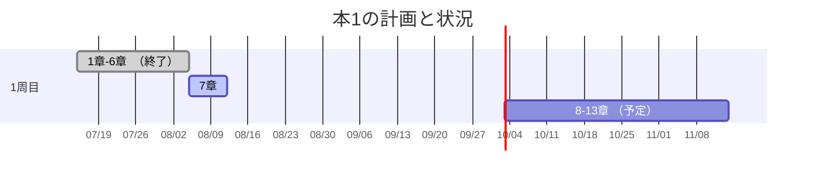

+++
title = "最初の投稿"
date = 2026-08-10
updated = 2026-08-11
description = "最初の投稿でtestを兼ねてる"
[extra]
mermaid = true
[taxonomies]
categories = ["learn"]
tags = ["test"]
+++

ここにサーマリーをかいておくといいかな。

<!-- more -->
最初のポストですね。
## Hello, world!

[zola](https://www.getzola.org/)の設置はほぼ完了したかな。テーマはlinkitaを使ってる。多少手を入れたいところはあるけど現状これで十分かな。

テンプレのショートコードをいくつか作りたいなぁと思ってる所。ただ、githubも無料でやってるのでこのレポジトリは公開されてる状態しか使えないというのは頭に入れておく必要があって、goole mapの埋め込みみたいなaptキーが絡むやつは使いづらいかもしれない。多少の不便はあっても日常には問題なさそうやからね。ショートコードもせいぜいyoutubeやbsky、instagramくらいはめ込むことを意識してるだけかもな。画像はレポジトリに余り置きたくないものね。大きいから。

## 使い方
今考えてるのは学習のログなんだよな。たとえばこんな感じで示してかいていこうかなと。





マーメイドのガントチャート使えるんで、視覚的にも文字だらけより分かりやすそうだし。学習で使う場合は2,3周するとは思うけど、プログラムも書けるし、数式も使えるし、なれてきたらわかりやすいログが作れそうには思うかな。
