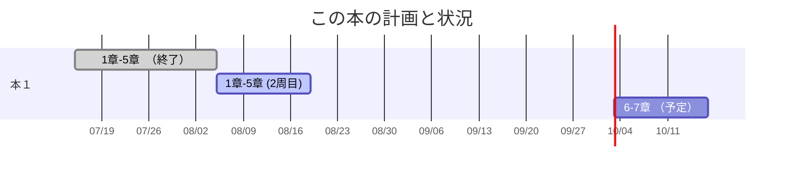
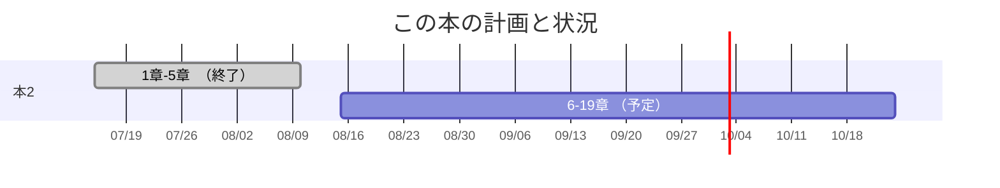

+++
title = "学習ログ 26-08-12 "
date = 2026-08-12
# update= 2026-08-11
# if you write to post, please comment out the below draft line.
# draft = true
[taxonomies]
categories = ["learn"]
tags = []
+++

学習ログとしての活用を考えてるけど、その第一歩として現在取り組んでることをすこしかいておく。

<!-- more -->
## 最初に
[About](/about)のところにかいておいた現象を理解して紐解くってのは洞察力が物を言うのはおそらくこの分野でも同じでしょう。ただ技法を適当に組み合わせて解いていくって感覚ではブラックボックスを闇雲に触ってれるだけになりがちなんでね。データから語りかける声を理解していくってのはおそらく、数式から現象の声を聞くってのと変わらないだろうと想像してますね。

初心者とは名乗らないけど、基本的に無知なんで、まずは感覚を掴むこと重視で行ってます。理解が浅くてもどんどん先に進んで適当な場所でまた1からやり直すって過程で行ってます。何層も重ねて作品を作っていく世界と同じですよ。

## 取り組んでる本の紹介

何冊かかいておくけど、あと追加で考えてるものはありますね。

紹介した本については出版社の紹介ページにリンクを張っておきます。


### kaggleで磨く機械学習の実践力





リックテレコムから出版されてる[kaggleで磨く機械学習の実践力](https://www.ric.co.jp/book/new-publication/detail/2168)はkaggleに興味を持って最初他の本を買ったけど、流石になんもわからん状態では手のつけようがない　😁　という状態だったんで、手順を理解するのによいなぁ。というので読んでます。ネットのリソースを漁ってもいいけど、体系的に学ぶのは本や講座に取り組むのが一番だからです。他の本というのは有名な勝つ本ですけど、あれは実際に取り組んでる人向けだってよく分かる内容でした。


このへんは出版社も内容を1つの章を限定して見せるなりしてくれる方が判断しやすいんだよね。多くの場合目次だけ公開してるし、ちらっと、全ページを遠くから見せる動画も出てることはあるが、本屋で確認できない今ではそれでは情報が足りないので適切な購買ができるかどうか読めないもの。非常に良くないと思ってます。本が安くないので信用買いの方向になってこの状況は新しい著者には不利になるんじゃないかなと思うよ。　


適当に計画示してるけど、現在は最初の章をもう一度読んでるところかな。どういう取り組みで問題を解決していくのかは感覚的な理解は出来たけど、流れを理解できたってだけの話しですね。

### Python機械学習プログラミング[PyTorch&scikit-learn編]

インプレス社から出版されてる[Python機械学習プログラミング[PyTorch&scikit-learn編]](https://book.impress.co.jp/books/1122101013)も取り組みだしてるけど、機械学習を理論とプログラミングからの視点で紐解くってことでおもしろいなぁ。なんですけど、数学的には大学教養程度の素養が必要で高校生くらいで読もうとなるのはかなり難しいし、高校数学だけでは厳しいと思ったな。この本は定評がある本なんで、この系統の本はこちらか　オライリーから出版されてる　[scikit-learn、Keras、TensorFlowによる実践機械学習 第3版](https://www.oreilly.co.jp/books/9784814400935/)　かが定本な印象なんですよね。





19章あってまだ5章くらいまでしか読んでないかなぁ。これだけでも闇雲にとりくむより流れを見るのには役立ってるかな。どういう技法がどういうときに使えて、どんなときに使えないのか？という性質的な理解までは届いてないかな。短期間で終わらすのは難しいなと思ってて早くて半年、長くて1年かなぁ。

計画の図は適当なところがありますが、おそらく、先に進むより、また1章から読むと思う。基本的なところから学ぶ流れは同じようなものってことなんでしょうね。

この本は多少アノテーションの違いはあるのですが、有名なオンライン講座の[Machine Learning Specialization](https://www.deeplearning.ai/specializations/machine-learning)というdeeplearning.aiの講座と並行して見てると相乗効果がある印象を持ちましたね。この講座は見るだけなら無料で取り組めます。

### Pythonによる時系列予測

マイナビブックから出版されてる[Pythonによる時系列予測](https://book.mynavi.jp/ec/products/detail/id=141029)ですが、時系列を見るのってやっぱりおもしろいんですよね。そこには現象の本質が声を上げてる部分があるんで、それをどうやって拾い上げるのか？洞察力でも行ける部分がある反面論理的に紐解くことも大切なんでね。それでこの本を買ってみてる。ただ、まだ取り組みまではしてないかな。上記の本を優先してるので

### その他
たぶん近々　O'REILLY の[データサイエンス設計マニュアル](https://www.oreilly.co.jp/books/9784873118918/)　も買ってみようかなぁ。と思ってますね。著者のSekina氏のユーチューブを見てるとこれに関連する大学抗議の動画を載せてたところまでは見てますね。これは根本的なセンスを養う源として読んだほうがいいなぁ。と思って探してた。どうやらこの本適当だなぁ。と思ってんでね。

技法やプログラミングの本は多んですが、根本的なセンスを養わんとなぁ。となる。統計のところもあんまり理解してるとは思ってないんでそちらも真面目に取り組まないとあかんやろなとは思ってますね。技法だけを理解して物事を正確に予測はたぶん厳しい。

いずれはkaggleへの取り組みも考えてるんですけどね。
