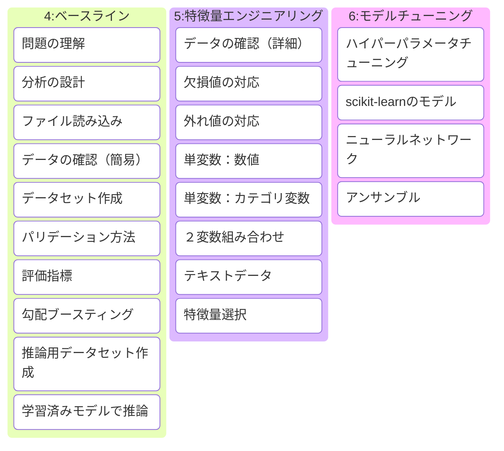

+++
title = "学習ログ 26-08-13"
date = 2026-08-13
# updated = 2026-08-11
description = ""
# if you write to post, please comment out the below draft line.
#draft = true

[extra]
mermaid = true
math = false

[taxonomies]
categories = ["learn"]
tags = ["learn-ML","learn-Kaggle"]
+++
今日の学習ログです。盆まっただ中というと、ペルセウス流星群を思い出してしまいますね。毎年のことなんですが、明け方になるとよく見られますのでね。
<!-- more -->
## Kaggleで磨く機械学習の実践力
- II部　機械学習の進め方

このII部は4-6章に分かれてて以下のように　

4. ベースライン作成
5. 特徴量エンジニアリングの進め方
6. モデルチューニング

と4-6章に分けて学習の進め方を説明してますね。





今日は4章のベースライン作成について学んでるところです。この各章の過程を分けて図にしていますけど、これを各セクションで説明されていて、解析していくときには各項目を微修正していってモデルを調整していきますね。これはものを作る時の基本的なプロセスとちかいと考えて良さそうと思いました。

これでトライアンドエラーを前提でプログラミングするわけですから、経験者なら最初からこの部分がチューニングしやすいように心がけた抽象化が重要なんだろうなって解釈しています。このトライアンドエラーで行う場合、見通して作るプログラミングをしないとかなりどっ散らかって収拾がつかなくなることは容易に想像できますね。これは頭においておかないとな。

この4-6章はkaggleの手始めた人向けによく取り上げられるタイタニックコンペを前提で説明しています。

　
タイタニックコンペを材料に説明しているものはこの本に限らず定番になってますので、様々な人が本やユーチューブで取り上げています。

コンペのデータなどを取る必要があるんですが、uv使ってるので、多くの場合はkaggle コマンドをそのまんま使うようなことが多いですが、ぼくの場合は `uvx kaggle ...` を使ってます。uv前提で扱う情報は殆どないので[別記事](/blog/how-to-use/register-kaggle-api-with-uv)を後に作っておきますね。
