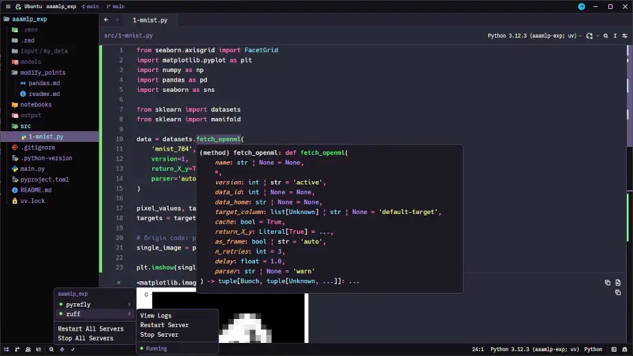

+++
title = "学習ログ 26-08-24 AAAMLPの写経のためのレポジトリとリファクタリング"
date = 2026-08-24
# updated = 2026-08-24
description = ""
# if you write to post, please comment out the below draft line.
# draft = true
path = "/blog/2026/08/learn-0824"

[taxonomies]
categories = ["learn"]
tags = ["learn-ML","Zed"]

[extra]
mermaid = false
math = false
+++

今日の学習ログは主にAAAMLPの写経を進めるためにレポジトリを用意した。ソースコードがoutdateなものになってる関係で最新のライブラリ用にリファクタリングしながら学ぼうと考えた。

<!-- more -->

## :book: Python機械学習プログラミング - PyTorch&scikit-learn編 
いくつか学習を細々と続けてるのですが、:book: Python機械学習プログラミング -PyTorch&scikit-learn編- これは読んでる途中でいまようやく６章まで軽く読んだところですね。他の本と重なってるところがいくつかあって、無感覚なときに読む時の右も左もわからないからなんとなく馴染みがあるというところに変わった感じがありますね。まだ、７章のアンサンブルへ進める気はなくて、いまは３-６章を復習しようと思ってますね。

## :book: AAAMLP
和書名はKaggle Grandmasterに学ぶ 機械学習 実践アプローチです。この前から原著を読んでてコードの作り方がきれいだなとかプロジェクトの管理方法が先を見通した上手さがあるなと感じたんで、やってみることにしたんですね。

- [https://github.com/yst4/aaamlp_exp/](https://github.com/yst4/aaamlp_exp/)

ただし、この本は大きな問題があって、ライブラリがアップデートされた関係でコードの記述が時代遅れでそのままでは動かないという問題が起きてるんですね。骨が折れるんですが、対話型AIのGeminiの支援を受けてリファクタリングしながら進めるという選択をしてます。メモを残す感覚でレポジトリを公開していますね。

リファクタリングも骨が折れるんで、完走できる自信は３０％ほどなんですけど、とりあえずやってみるってところです。レポジトリには修正ポイントなど必要な情報を書き残しておくようにしています。`UV`でプロジェクト管理をしているので、dockerやanacondaなどでやる場合と違っていますが、uv用のpyproject.tomlではjupyter,ipythonからlsp対応まで考えた構成にしてあります。

### :notebook: zedでの設定


    
基本的にはZedを利用していて、基本的にjupyter相当なことはエディタで完了しています。vscodeならjupyter notebookで利用できるけど、zedはまだ未対応です。

補完などのLSPにはRuffとpyreflyを利用していますが、pyprojectではbasedpythonを利用した名残が残っています。レポジトリには含めてないけど、 zed用のlsp設定のファイルは `~/.config/zed/config.json`はつぎのようにしてあります。（注:この設定もbasedpythonの物が残っています。）ここで行ってるのはWSL/ubuntu 26.04で行ってます。

```
{
  "venvPath": ".",
  "venv": ".venv",

  "languages": {
    "Python": {
      "python_binary": {
        "path": ".venv/bin/python"
      },
      "language_servers": [
        "!basedpyright",
        "pyrefly",
        "ruff"
      ],
      "code_actions_on_format": {
        "source.organizeImports.ruff": true
      },
      "formatter": {
        "language_server": {
          "name": "ruff"
        }
      }
    }
  },
  "lsp": {
    "basedpyright": {
      "binary": {
        "path": "basedpyright-langserver",
        "arguments": ["--stdio"]
      },
      "settings": {
        "basedpyright": {
          "analysis": {
            "typeCheckingMode": "standard",
            "diagnosticMode": "workspace",
            "inlayHints": {
              "callArgumentNames": false
            },
            "diagnosticSeverityOverrides": {
              "reportUnusedCallResult": "none"
            }
          }
        }
      }
    },
    "pyrefly": {
            "binary": {
                    "path": "pyrefly",
                    "arguments": ["lsp"]
            }
    },
    "ruff": {
      "binary": {
        "path": "ruff",
        "arguments": ["server"]
      }
    }
  },
  "feature_flags": {
   "tabular-data-preview": "on",
   "notebooks": "on",
  }
}
```

jupyterもlspを設定できるようにしてありますがここでは割愛しておきます。jupyter-lspはpc次第では動作が遅いものですからね。ただuvでbasedpython, ruff, pyreflyをインストールしてパスを通しておく必要はあります。

```
uv tool install ruff
uv tool install basedpyright
uv tool install pyrefly
```
とでもしておけばいいです。zedでは基本的に補完やライブラリの説明は出るようにできています。パスに関しては以下のものが`~/.bashrc`に含まれていれば大丈夫だと思います。
```
. "$HOME/.local/bin/env"
```

~/.bashrcを更新したら必ず
```
$ source ~/.bashrc
```
をしてみてくださいね。もう一つ補足です。wsl/ubuntuのmatplotlibをipythonなどで表示する場合はpyside6を利用しています。それは次の記事にまとめてあるので見てください。

- [WSL環境で利用するmatplotlib](/blog/how-to-use/matplotlib-and-pygame-on-wsl-ubuntu/)
