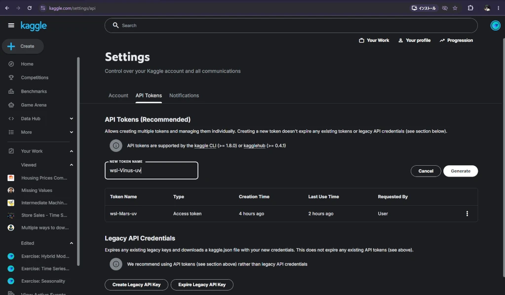
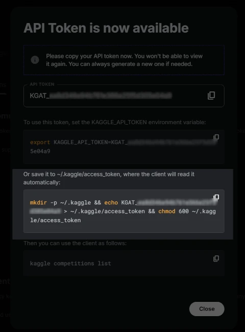

+++
title = "uvを利用している時のkaggle apiの利用方法"
date = 2026-08-13
updated = 2026-08-19
description = ""
# if you write to post, please comment out the below draft line.
#draft = true
path ="/blog/how-to-use/register-kaggle-api-with-uv"
[extra]
mermaid = false
math = false

[taxonomies]
categories = ["learn","how-to-use"]
tags = ["kaggle","uv"]
+++
uvを活用してる時のkaggle cliの扱いをすこしメモにおいておく。
<!-- more -->
## 手順
導入の仕方なんですが、次のようになります。

1. kaggle アカウントを作る
2. kaggle api keyを取得する
3. kaggle api keyをPC環境に登録する

ということです。これが終わって

4. uvのインストール
5. uvx kaggleを使えるようにする

それだけですね。ここで説明するのは、2番目のkaggle apiの取得からPC環境に登録までと、5番のuvx kaggleで利用できるようにするという段階までです。uvx kaggleはなければ自動的にインストールされますので、実質2,3の説明だけになります。 


ただしkaggle apiのPC環境の登録の仕方がlinuxやMacOSのシェル上の操作を意識したものなのでWindows11 Powershellでは使えないです。僕はWindows11のWSL2/Ubuntuという環境で行ってることをかいておきます。
　
## kaggle api keyを取得し登録する

すでにkaggleアカウントを作ってるという前提で進めます。まずはapi [設定画面](https://www.kaggle.com/settings/api) __https://www.kaggle.com/settings/api__ を開いてください。 



この画像で既にapiのタブが示された状態になってます。この画面のAPI Token (Recommended)の下にあるNEW TOKEN NAMEという部分にPCの環境の名前でも入力して起きます。ここではwsl-Vinus-uvとしています。僕のwsl環境のPCの名前（Vinus)ということで作ってます。uvまで名前についてますがあってもなくてもよいです。環境次第ですね。
そうすると



が開きます。いくつかの種類が示されてるのですが、該当箇所をコピペしてターミナルでコピペしてenter(実行)させてしまえば自動的にkaggle api keyが~/.kaggle/access_tokenという名前でapi keyが登録されますので、これで環境が整いました。ここでぼかしを掛けてる _KGAT_数字_　というのがkaggle api keyになります。

ここまではuvを使わなくてもアナコンダなどの他の環境でも共通です。ただし、ターミナルを利用しています。


api keyをダウンロードして　ディレクトリ ~/.kaggle の下に移すって方法も示されてるんですが、この場合はパーミッションの変更を忘れやすく、それがセキュリティホールになる危険にあるんですね。このkaggleから直接コピペするものはchmod 600というパーミッション変更も含まれてるので、セキュリティの問題も起こさない方法なのです。


## uvでkaggle cliを利用する

uvがインストールされているのでしたら。簡単です
```
$ uv tool install kaggle
```
としてしまえば、インストールされます。このへんはpipを明示的にしなくても自動的に行われてその後も気にしなくていいです。試しにコンペのリストでも取ってみましょうか。これで~/.local/bin/kaggleがインストールされます。このパス ~/.local/bin が$PATHに含まれてないと実行できないので、uvのインストールは他のサイトの紹介で行ってくださいね。

```
$ kaggle c list
ref                                                                           deadline             category         reward  teamCount  userHasEntered  userRank
----------------------------------------------------------------------------  -------------------  --------  -------------  ---------  --------------  --------
https://www.kaggle.com/competitions/passenger-screening-algorithm-challenge   2017-12-15 23:59:00  Featured  1,500,000 Usd        518           False         0
 ... (以下略)
```
となります。このようにkaggle ... で使えるようになります。インストールせずに使う場合はuvx kaggleでもできます。

常に最新版のkaggleで行いますが、いちいちダウンロードするのでいつも起動が遅くなります。


いちいちuvx kaggleと打ちたくないというのでしたら。bashなどシェル環境のエリアスを設定を~/.bashrcなどに書いておくのもよいです。いっぱいエリアスつくる人なら~/.aliasesを作って、それを~/.bashrc内で source ~/.aliasesとか書いておくんですけどね。
```
$ alias kaggle='uvx kaggle'
$ kaggle
usage: kaggle [-h] [-v] [-W]
...（以下略)
```
~/.bashrc などに　一行　alias kaggle='uvx kaggle'　と加えておくとよいです。利用シェル環境で違ってくる。

私の利用してるubuntu以外の環境でしたら、たとえばmac terminal aliasなどで検索してみてください。こうしておくことで、`$ kaggle ...` と実行してもOSの方で$ `$ uvx kaggle ...` と自動的に解釈して実行してくれます。
　
