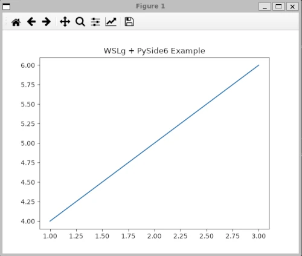

+++
title = "WSL環境で利用するmatplotlib"
date = 2026-08-15
# updated = 2026-08-11
description = ""
# if you write to post, please comment out the below draft line.
#draft = true
path ="/blog/how-to-use/matplotlib-and-pygame-on-wsl-ubuntu"
[taxonomies]
categories = ["how-to-use"]
tags = ["WSL","matplotlib","pygame"]

[extra]
mermaid = false
math = false
+++
これは過去に作ったものなので再現性まで確認できてないけど、当時同じことで２台動かしたので。ここではpyside6を使ってwsl/ubuntu環境でmatplotlibを表示させる手順を残しておきます。
<!-- more -->

wsl環境でjupyterを使わないでグラフ表示をさせる場合は可能です。昔は厳しかったけどWSLgというのが使えるようになったのでlinuxなどのX Windowシステムが表示ができるようになってるんですね。


- WSL2/Ubuntu 26.04 LTS

aptを使ってインストールしてるのでdebian系を使ってるのなら似たりよったりでしょう。すでにuvが使える環境になってることは前提で記事にしています。もしWSL-Ubuntuでuv環境を整えてないのでしたら、他の記事を検索してみてください。


## pyside6 + matplotlib 
この２つの組み合わせでQtバックエンドでmatplotlibが表示可能になってます。ただuv で `uv add pyside6 matpltlib`をしただけで使えるというものではないのが注意です。それはqt6のライブラリがWSLの下のubuntu環境に入ってないからです。まずは必要なライブラリを入れてみましょう。これがなければエラーが出ます。

``` bash
sudo apt update
sudo apt install -y libxcb-cursor0 libxkbcommon-x11-0 libxcb-icccm4 libxcb-image0 libxcb-keysyms1 libxcb-randr0 libxcb-render-util0 libxcb-xinerama0 libxcb-xfixes0 libxcb-shape0
```

これが必要なライブラリをインストールする手順ですね。これで基本的に完了です。

## uvでのテスト
sandbox というプロジェクトを作ってみましょう。

``` bash
uv init sandbox
```

そしてライブラリを入れてみます。

``` bash
cd sandbox
uv add matplotlib pyside6
uv add ipython --dev
```

これでとりあえずipythonまで動せるようにしておきます。テストコードですが次のものです。一応`sandbox/src/test.py` と名付けておきます。

``` python
import matplotlib
# matplotlib.use('QtAgg')  # PySide6をバックエンドとして使用
import matplotlib.pyplot as plt

# 描画処理
plt.plot([1, 2, 3], [4, 5, 6])
plt.title("WSLg + PySide6 Example")
plt.show()
```

matplotlibのバックエンドをQtにするということをしておくのは明示しなくても自動的に行われますので、コメントアウトした一行を一応示しておきます。明示したいときはあのようにしてください。

ipythonで動かしてみましょう。
```
$ uv run ipython
Python 3.12.13 (main, Jun 11 2026, 04:03:26) [Clang 22.1.3 ]
Type 'copyright', 'credits' or 'license' for more information
IPython 9.16.1 -- An enhanced Interactive Python. Type '?' for help.
Tip: The `%timeit` magic has a `-o` flag, which returns the results, making it easy to plot. See `%timeit?`.

In [1]: import matplotlib
   ...: matplotlib.use('QtAgg')  # PySide6をバックエンドとして使用
   ...: import matplotlib.pyplot as plt
   ...:
   ...: # 描画処理
   ...: plt.plot([1, 2, 3], [4, 5, 6])
   ...: plt.title("WSLg + PySide6 Example")
   ...: plt.show()
Call to org.freedesktop.portal.Settings.ReadAll failed QDBusError("org.freedesktop.DBus.Error.ServiceUnknown", "The name org.freedesktop.portal.Desktop was not provided by any .service files")
Call for getting org.freedesktop.portal.FileChooser version failed QDBusError("org.freedesktop.DBus.Error.ServiceUnknown", "The name org.freedesktop.portal.Desktop was not provided by any .service files")

In [2]:
```
plot.show()のあとウインドウが開き直線のグラフが出てきます。出ればOKです。ウインドウの右のXをクリックすれば終了です。



`Call to org.freedesktop....` というワーニングが出ますが、これはWSLg 特有の仕様（Desktop Portal 非搭載）によるものであり、グラフ表示および動作には問題ないため無視してよい。(geminiに聞いてみた。)


ここではipythonを利用して確認してますが、次のようにしてもよいです。
```
uv run src/test.py
```

## WSLg のスケーリング設定（高解像度ディスプレイ対策）
解像度次第では小さい運動になることがあります。特に高解像度ディスプレイを利用してる場合に起こります。簡単な対処は少し書いておきます。
これは WSLの設定を書くのでwindowsのpowershellで行ってください。
ユーザーのディレクトリのしたに `.wslgconfig`というファイルを作成します。
そこに次のように書いてください。場所は `C:\Users\<ユーザー名>\.wslgconfig` です。
```
[system-distro-env]
WESTON_RDP_FRACTIONAL_HI_DPI_SCALING=true
WESTON_RDP_HI_DPI_SCALING=true
WESTON_RDP_DEBUG_DESKTOP_SCALING_FACTOR=200
guiApplications=true
```
と書いて、一度 ubuntuをシャットダウンさせます。
```
wsl --shutdown
```
これでwsl2上のubuntuを再起動すればいいです。ここで、SCALING FACTOR 200にしてありますが。200%の意味です。詳細はわからないけど、125や150なら汚い表示になることが知られてるので2倍のサイズにしてあります。

## 補足: WSL で pygame を動かす場合
おまけとして書いておきます。テストコードは用意しませんが、pygameも動くようにしています。pygameは独自のエンジンを利用してますので、pyside6は不要です。

ただし、SDL 関連のシステムライブラリが不足している場合は以下の `apt` パッケージを追加することで動作します。

``` bash
sudo apt update
sudo apt install -y libsdl2-2.0-0 libsdl2-image-2.0-0 libsdl2-mixer-2.0-0 libsdl2-ttf-2.0-0 libasound2
```

僕も既にこれはインストールされていて動いてるのは確認しています。あとはuv add pygameでなんとかなります。
