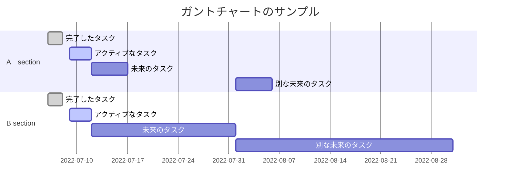

+++
title = "first post"
date = 2026-08-10
hidden=true
[taxonomies]
tags = []

[extra]
date_format = "%m-%d"
hidden= true
mermaid = true
math = true
+++
これはtest投稿です。学習ログなど残しておくために用意しています。
<!-- more -->

:smile: :warning:

## :orange_square: 数式

$$x = {-b \pm \sqrt{b^2-4ac} \over 2a}\$$
## marmaid記法





## admonition


The `tip` admonition.


## ソースコード

rust 公式のチュートリアルの数字あてゲーム


```rust,linenos,name=guessing_game.rs
use std::io;
use std::cmp::Ordering;
use rand::Rng;
fn main() {
    println!("Guess the number!");

    let secret_number = rand::thread_rng().gen_range(1..101);


    println!("The secret number is: {}", secret_number);    //秘密の数字は次の通り: {}

    loop{
        println!("Please input your guess.");

        let mut guess = String::new();

        io::stdin()
            .read_line(&mut guess)
            .expect("Failed to read line");

        let guess: u32 = guess.trim().parse()
            .expect("Please type a number!");                 //数値を入力してください！

        println!("You guessed: {}", guess);

        match guess.cmp(&secret_number) {
            Ordering::Less => println!("Too small!"),
            Ordering::Greater => println!("Too big!"),
            Ordering::Equal => {
                println!("You win!");
                break;
            }
        }
    }
}
```

[](/)

